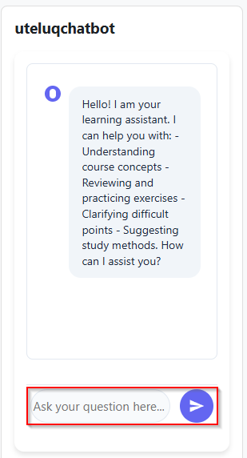
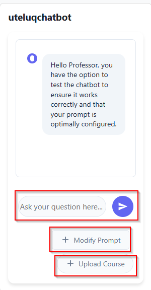
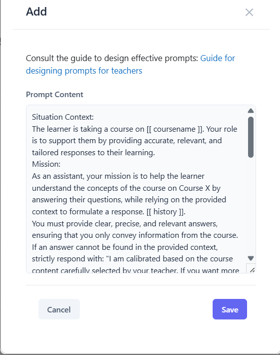
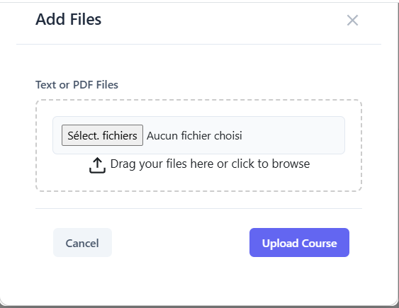
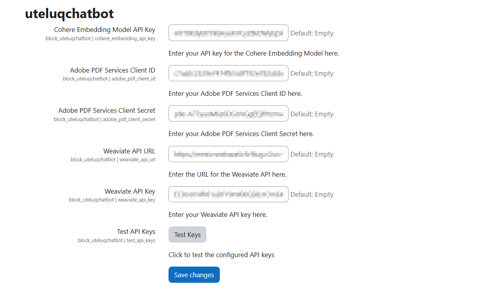

# Moodle Block uteluqchatbot

The uteluqchatbot plugin is a Moodle block plugin designed to enhance distance learning by providing an adaptive and innovative chatbot solution. Integrated into the Moodle platform, it supports three distinct user roles—Learner, Teacher, and Administrative Manager—to facilitate course interactions, content management, and plugin configuration. This plugin leverages Retrieval-Augmented Generation (RAG) to deliver precise, context-aware responses based on course materials, improving the learning experience for users.

## Maturity
- The plugin is in alpha version currently. We have validated it internally on a test server but it may still contain significant bugs. We do not currently recommend the plugin for production use.

## Supported Languages
The plugin currently supports the following languages:

- **French (fr)**
- **English (en)**
- **Arabic (ar)**
- **Danish (da)**
- **German (de)**
- **Haitian Creole (ht)**
- **Hindi (hi)**
- **Italian (it)**
- **Japanese (ja)**
- **Polish (pl)**
- **Portuguese (pt)**
- **Russian (ru)**
- **Spanish (es)**
- **Swahili (sw)**
- **Chinese (Simplified) (zh_cn)**

## Features

### Learner Role
- **Interactive Q&A**: Learners can ask questions about course content, receive clarifications, revise exercises, and get study method suggestions via a user-friendly interface.
- **Contextual Responses**: With RAG enabled, the chatbot provides accurate, course-specific answers by retrieving relevant information from uploaded course materials.

### Teacher Role
- **Course Upload**: Teachers can upload multiple PDF course resources simultaneously, which the chatbot uses to generate informed responses.
- **Prompt Customization**: Teachers can modify the default prompt to tailor the chatbot’s behavior, supported by a provided [Prompt Design Guide](#).
- **Testing Functionality**: Teachers can test the chatbot by posing questions to verify its performance with uploaded resources.

### Administrative Manager Role
- **Plugin Configuration**: Admins configure the plugin via Moodle’s site administration interface, setting up API keys for services like Cohere, Adobe PDF Services, and Weaviate.
- **Seamless Integration**: The plugin is accessible under the “Plugins” section of Moodle’s admin panel for easy management.

### RAG Integration
- **With RAG**: Enhances response accuracy, relevance, and completeness by retrieving course-specific data from a vector database before generating answers.
- **Without RAG**: Provides general responses based on the model’s internal knowledge, suitable for quick interactions but less precise for course-specific queries.

## Installation

### Download the Plugin:
- Clone the repository: `git clone https://github.com//moodle-block_uteluqchatbot.git uteluqchatbot`
- Or download the ZIP file from the [Moodle Plugins Directory](https://github.com/uteluq/moodle-block_uteluqchatbot/blob/main/README.md#) (once published).

### Install in Moodle:
- Copy the `uteluqchatbot` folder to the `/blocks/` directory of your Moodle installation.
- Navigate to **Site Administration > Notifications** in Moodle to trigger the installation process.
- Follow the on-screen instructions to complete the setup.

### Configure the Plugin:
- Go to **Site Administration > Plugins > Blocks > uteluqchatbot**.
- Enter the required API keys for Cohere, Adobe PDF Services, and Weaviate.
- Save the settings to activate the plugin.

### Add the Block to Course Pages:
- To make the Chatbot visible on all course pages, go to a course and turn editing on.
- In the **Add a block** menu, select **uteluqchatbot**.
- After adding it, click on the block’s settings (gear icon), then choose **Configure uteluqchatbot block**.
- Under **Where this block appears**, set **Display on page types** to **Any page**.
- Save changes to apply the block site-wide within the course.

## Usage

### For Learners
- Access the chatbot block on a course page.
- Pose questions related to course content in the provided text box.

### For Teachers
- From the chatbot interface, click **Upload Course** to add PDF resources.
- Click **Modify Prompt** to customize the chatbot’s response behavior, referring to the [Prompt Design Guide](#).
- Test the chatbot by asking questions to ensure it aligns with course content.

### For Admins
- Access **Site Administration > Plugins > Blocks > Chatbot**.
- Configure API keys and other settings as needed.
- Monitor plugin performance and ensure API services are operational.

- 

## Testing and Validation

The plugin has been rigorously tested in both academic and AWS cloud environments to ensure robustness and scalability (see project report, Section 2). Key findings include:

- **RAG Mode**: Outperforms non-RAG mode in precision, relevance, completeness, and pedagogical utility, with clear, context-aware responses and no noticeable latency.
- **Non-RAG Mode**: Offers satisfactory clarity and speed but may provide less accurate or overly general responses for course-specific queries.

A detailed testing protocol will be published, with evaluation criteria including:

- Precision, relevance, clarity, and completeness of responses.
- Response time, dialogue coherence, and pedagogical utility.
- Comparative testing with and without RAG, using provided course PDFs.

## Requirements

- **Moodle Version**: Compatible with Moodle [specify version, e.g., 4.1+] (ensure compatibility with maintained versions as per [Moodle Releases](https://moodledev.io/general/releases)).
- **Database**: Tested with MySQL and PostgreSQL, using Moodle’s [Data Manipulation API](https://moodledev.io/docs/5.1/apis/core/dml).
- **API Services**:
  - [Cohere] for text and embedding generation in vector DB integration.
  - [Adobe PDF Services] for processing uploaded course materials.
  - [Weaviate] for vector database storage and retrieval.
- **Server**: Deployable on standard Moodle servers or AWS for scalability.

## Web Services

The Chatbot Moodle block plugin integrates several web services to support its functionality, as outlined in the project report. These services are configured via the plugin's administrative interface and are essential for processing course materials, generating responses, and enabling Retrieval-Augmented Generation (RAG). Below is a list of the web services used:

- **[Cohere API](https://docs.cohere.com/cohere-documentation)**:
  - **Purpose**: Powers the language generation component by providing model responses for user queries, supporting both RAG and non-RAG configurations.
  - **Default Model**: Cohere is the default model used for text generation in the system.
  - **Configuration**: Requires an API key to be specified in the plugin’s admin interface (see Figure 8).

- **[Cohere Embedding API](https://docs.cohere.com/cohere-documentation)**:
  - **Purpose**: Creates embeddings for course content, enabling storage and retrieval in a vector database for RAG-based contextual responses.
  - **Configuration**: Requires an API key entered in the plugin’s admin settings.

- **[Adobe PDF Services](https://developer.adobe.com/document-services/apis/pdf-services)**:
  - **Purpose**: Processes uploaded PDF course materials to extract content for response generation.
  - **Configuration**: Requires a client ID and client secret entered in the plugin’s admin settings.

- **Weaviate** ([Server Installation](https://weaviate.io/developers/weaviate/installation) | [Weaviate Cloud](https://weaviate.io/developers/wcs)):
  - **Purpose**: Acts as the vector database to store content embeddings, supporting the retrieval component of RAG for contextual responses.
  - **Configuration**: Requires API key(s) entered in the plugin’s admin settings (note: multiple entries in the report may indicate an OCR error or distinct keys).

Configuration is managed through **Site Administration > Plugins > Blocks > Chatbot** in Moodle.

## Contributing

Contributions are welcome! To contribute:

1. Fork the repository: [https://github.com/uteluq/moodle-block_uteluqchatbot](https://github.com/uteluq/moodle-block_uteluqchatbot).
2. Create a feature branch: `git checkout -b feature/your-feature`.
3. Commit changes: `git commit -m "Add your feature"`.
4. Push to the branch: `git push origin feature/your-feature`.
5. Open a pull request.

Please adhere to Moodle’s [Coding Style](https://moodledev.io/general/development/policies/codingstyle) and submit issues via the [GitHub Issues page](https://github.com//moodle-block_uteluqchatbot/issues).

## License

This plugin is licensed under the GNU General Public License v3.0 or later (GPLv3+). See the [LICENSE](https://github.com/uteluq/moodle-block_uteluqchatbot/blob/main/LICENSE) file for details.

## Support

For issues, feature requests, or questions:

- File an issue on the [GitHub Issues page](https://github.com//moodle-block_uteluqchatbot/issues).
- Refer to the [Moodle Tracker](https://tracker.moodle.org/) for broader Moodle-related support.
- Consult the [Moodle Documentation](https://docs.moodle.org/) or the plugin’s [Prompt Design Guide](https://github.com/uteluq/moodle-block_uteluqchatbot/blob/main/README.md) for specific guidance.

## Acknowledgments

Developed under the PROJET R&I 2024 Composante 2 by the UNIVERSITÉ TÉLUQ & UNIVERSITÉ GASTON BERGER DE SAINT-LOUIS and the Université Gaston-Berger. Special thanks to the Agence Universitaire de la Francophonie (AUF) for supporting this initiative.
